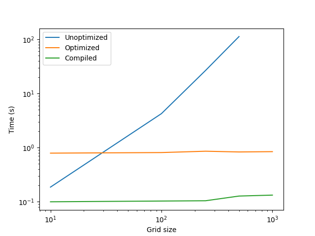

# Game of Life in JAX

A high-performance implementation of Conway's Game of Life using JAX, featuring both CPU and GPU support. This implementation leverages JAX's vectorized operations and JIT compilation for optimal performance.

The example below compares python loops (Unoptimized), JAX Numpy arrays without JIT compilation (Optimized) and compiled JAX code (Compiled).




## Features

- 🚀 High-performance implementation using JAX's vectorized operations
- 🎮 Multiple implementation variants:
  - Unoptimized (Python loops)
  - Optimized (JAX vectorized operations)
  - Compiled (JIT-compiled for maximum performance)
- 🖥️ GPU support through JAX
- 📊 Visualization capabilities
- 🧪 Comprehensive test suite
- 📈 Benchmarking tools

## Requirements

- Python 3.12.7
- JAX & jaxtyping (follow their guide)
- NVidia GPU for benchmarks
- Numpy, matplotlib and timeit for benchmarking
- pytest and pre-commit for developping


## Installation

1. Clone the repository:
```bash
git clone https://github.com/yourusername/game-of-life-jax.git
cd game-of-life-jax
```

2. Create and activate a virtual environment:
```bash
python -m venv .venv
source .venv/bin/activate  # On Windows: .venv\Scripts\activate
```

3. Install dependencies. I provide my own setup but you will most likely have to cherry pick libraries versions according to your hardware.
```bash
pip install -r requirements.txt
```

## Usage

The core functionality is implemented in `src/game_of_life.py`. Here's a basic example:

```python
from src.game_of_life import generate_initial_grid, compiled_gameoflife

# Generate a random initial grid
grid = generate_initial_grid(size=100, proportion_alive=0.5)

# Run the simulation for 100 iterations using the compiled version
result = compiled_gameoflife(grid, n_iter=100)
```

## Implementation Details

The implementation uses three main functions:
1. `augment_grid`: Adds padding around the grid to handle edge cases
2. `compute_neighbors`: Efficiently calculates neighbor sums using JAX's roll operations
3. `next_turn`: Applies Conway's rules using boolean operations

## Performance

The implementation offers three variants:
- `unoptimized_gameoflife`: Traditional Python implementation using loops
- `optimized_gameoflife`: Vectorized implementation using JAX operations
- `compiled_gameoflife`: JIT-compiled version for maximum performance

## Testing

Run the test suite using pytest:
```bash
pytest -v
```


## License

This project is licensed under the MIT License - see the LICENSE file for details.

## Author

- rayanehmi@github

